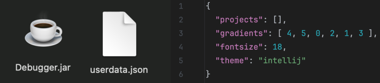

# DSON 
A custom Java-to-JSON serializer/deserializer.

This library supports directly converting Java objects into JSON strings and back, by directly inspecting the object's fields.

## Installation
To install, simply drag and drop the 3 Java files into any codebase you want, and you are good to go.

## Serialization
To serialize a Java object into a JSON string, simply call ```DSON.serialize(x)``` and a JSON formatted string will be returned.

All fields will be converted by default (including private fields), and nested objects will be automatically handled.

### Pretty Printing
The direct output of ```DSON.serialize()``` will look something like this:
```java
{applemap:[{key:"HEAVY_APPLE_1",value:{weight:100,tasty:false}},{key:"LIGHT_APPLE_1",value:{weight:1,tasty:true}},{key:"LIGHT_APPLE_2",value:{weight:3,tasty:false}}]}
```
In order to pretty-print the JSON string, you can simply run ```DSON.prettyPrint(x)```.
```java
{
    applemap: [{
        key: "HEAVY_APPLE_1",
        value: {
            weight: 100,
            tasty: false
        }
    },{
        key: "LIGHT_APPLE_1",
        value: {
            weight: 1,
            tasty: true
        }
    },{
        key: "LIGHT_APPLE_2",
        value: {
            weight: 3,
            tasty: false
        }
    }]
}
```

## Deserialization
To deserialize a JSON string into a Java object, simply call ```DSON.get(x).parse(s)```, where s is the JSON string and x is the Java object. The object's fields will directly be populated with values corresponding to those given in the JSON string (with automatic type deduction).

If nested classes are present, the default no-arg constructor of the respective class will be called.

## Field Modifier Annotations
In some cases, you may not want a field to be serialized/deserialized. In that case, you can simply use the ```@DSON.DoNotSerialize``` annotation to prevent it from being converted in the process.

```java
@DSON.DoNotSerialize
private String password;
```

Additionally, there also exists cases where you want a field to be reflected under a different name in JSON strings. In that case, you can use the ```@DSON.Rename(...)``` annotation to modify its external name. Note that this works for both serialization and deserialization.
```java
@DSON.Rename("originX")
private double ox;
@DSON.Rename("originY")
private double oy;
```

## Real-World Applications
This library can be used as a handy tool for storing Java object data in JSON file formats. For example, this library has been successfully utilized in my Debugger project to store the app's storage data (user settings, project names, directories, etc) in-between sessions.

